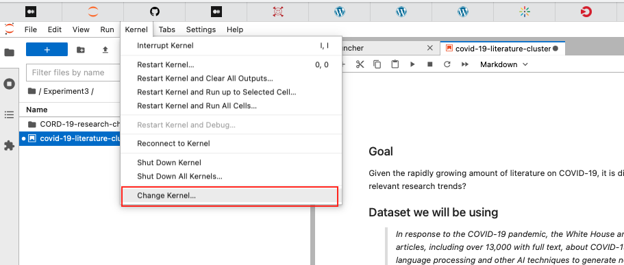
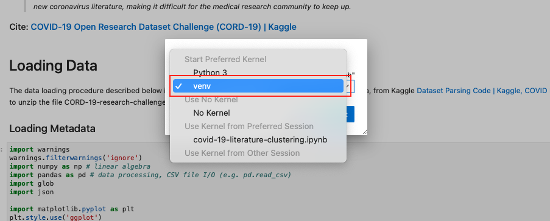

# CS5525 Project2 - Getting Started on Using rlogin.cs.vt.edu

## Step 1. Creating Account
If you do not have an account on `rlogin.cs.vt.edu`, open a new account here: https://admin.cs.vt.edu/password/

## Step 2. Logging into rlogin Server
Open a terminal on your machine and type in:

```
ssh -L 8000:localhost:xxxx pid@rlogin.cs.vt.edu
````

Replace "xxxx" with an arbitrary 4 digits number, for example 8765. This will be used as the port number to open Jupyter Lab later. 
Replace "pid" with your vt id, for example "kklein".
Enter your password.

## Step 3. Setting up the Enviornment

Execute the following lines of codes to setup the virtual enviornment (venv):

```
mkdir 5525_Project2
cd 5525_Project2
python3 -m venv ./venv
source venv/bin/activate
```
This code will activate the virtual environment (venv), where you will install necessary packages.

## Step 4. Installing Python Packages

Execute the following commands line by line to install the required packages:
	
```
python3 -m pip install jupyterlab
python3 -m pip install --user ipykernel
python3 -m ipykernel install --user --name=venv
python3 -m pip install numpy pandas sklearn
python3 -m pip install gdown
python3 -m pip install Pillow==7.2.0
python3 -m pip install seaborn bokeh
```

## Step 5. Downloading Data

To download the `CORD-19-research-challenge.zip` dataset for Problem 3 (which is relatively large), you will use gdown to download the dataset on rlogin server by executing the following commands:
	
```
gdown -O Experiment3/CORD-19-research-challenge/ https://drive.google.com/uc?id=1IC0s9QoBLWFN9tRI-z2QbJJWgngfAm8w
cd Experiment3/CORD-19-research-challenge
unzip CORD-19-research-challenge.zip
cd ~/5525_Project2/
```

This should download `CORD-19-research-challenge.zip` inside `5525_Project2/Experiment3/CORD-19-research-challenge' folder, and then unzip it into the same folder.

## Step 4. Opening Jupyter Lab

Execute the following command on rlogin server (replace xxxx by the port number you used during ssh in Step 2):
	
```
jupyter lab --port xxxx --no-browser
```

You may get a message that looks like the following:
```
    To access the notebook, open this file in a browser:
        ....
    Or copy and paste one of these URLs:
        http://localhost:xxxx/?token=c3c6074b04bff28d83fdc5d0ede431c0a121774816db49b2
     or http://127.0.0.1:xxxx/?token=c3c6074b04bff28d83fdc5d0ede431c0a121774816db49b2
```

It shows your jupyter server is running at port xxxx and your token will be the string after "token=". For example, here the token is `c3c6074b04bff28d83fdc5d0ede431c0a121774816db49b2`.

On your PC, open `http://localhost:xxxx` in a browser. For the first time login, you may be asked to provide token to create a password.

The xxxx value should be the same as the number you pick. Otherwise, you may need to pick another value for xxxx and login again.

You may be able to see the UI of Jupyter Lab. By default, it has a side bar with file explorer at left and a notebook editor at right.

You should be able to upload the notebook "covid-19-literature-clustering.ipynb" into the `Experiment3` folder by draggin it into the file explorer in the Jupyter Lab UI.

## Step 5. Changing the kernel

After opening a jupyter lab notebook, you can change the kernel to your preferred kernel (venv). At the top menu bar you can find an option to change the kernel. Select venv kernel as your preferred kernel for this project.



Now, you are ready for the "covid-19-literature-clustering.ipynb" notebook. `Save` the notebook and `close` the tab, when you are done. Closing the terminal on your machine will shut down the jupyter notebook.

## Step 6 (Optional). Reopening the Jupyter Lab Notebook

To reopen the notebook after closing the terminal, you need to follow these instructions:
- Open a terminal on your machine and type in:

```
ssh -L 8000:localhost:xxxx pid@rlogin.cs.vt.edu
````
xxxx can be a new value and will be used as the port number to open Jupyter Lab later. Enter your password.

- After login, execute the following commands line by line:
	
```
cd 5525_Project2
source venv/bin/activate
jupyter lab --port xxxx --no-browser
```
Note that the above three lines are the code you need to execute each time you login into the remote machine.
On your PC, open `http://localhost:xxxx` in a browser. It might ask for the password you set in Step 4.

DONE! Happy coding.

<!--
Follow the following:

- Close the terminal and open a new one.
- Use a new value of xxxx, type in:

`ssh -L 8000:localhost:xxxx pid@rlogin.cs.vt.edu`

Double click to open it in the notebook editor.Download the dataset into your machine from Google Drive:
https://drive.google.com/file/d/1IC0s9QoBLWFN9tRI-z2QbJJWgngfAm8w/view

Drag the downloaded "CORD-19-research-challenge.zip" into the file explorer in your Jupyter Lab UI. It will start uploading the file into the remote server. 

It might take a while and please make sure you have stable network connection.Click on the "+" button on top of the file explorer and choose terminal in the popped out tab. Then type in the following:
	
```
cd COVID_clustering
unzip CORD-19-research-challenge.zip
```
-->
